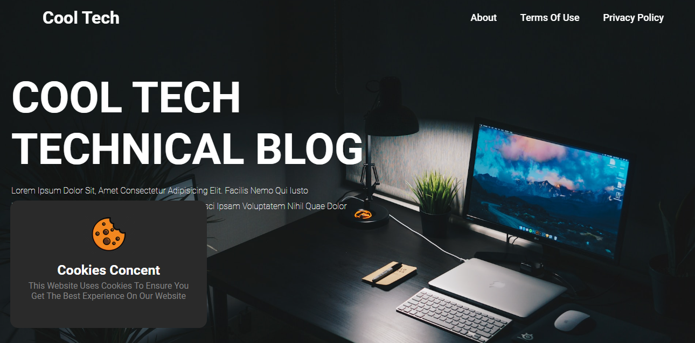
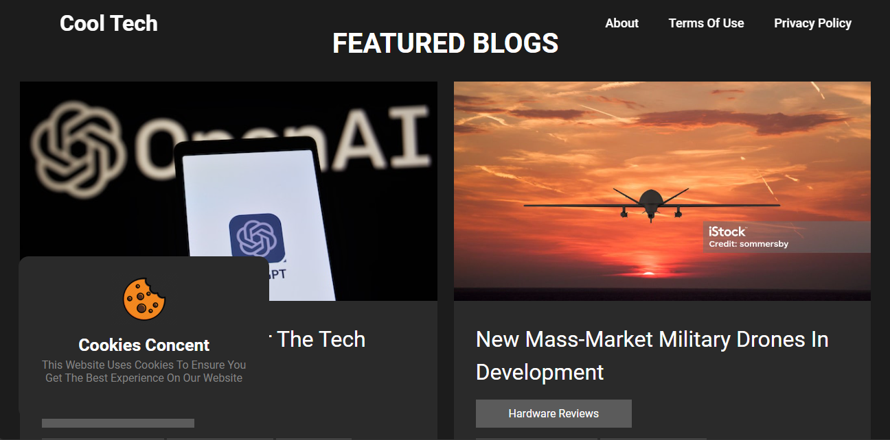
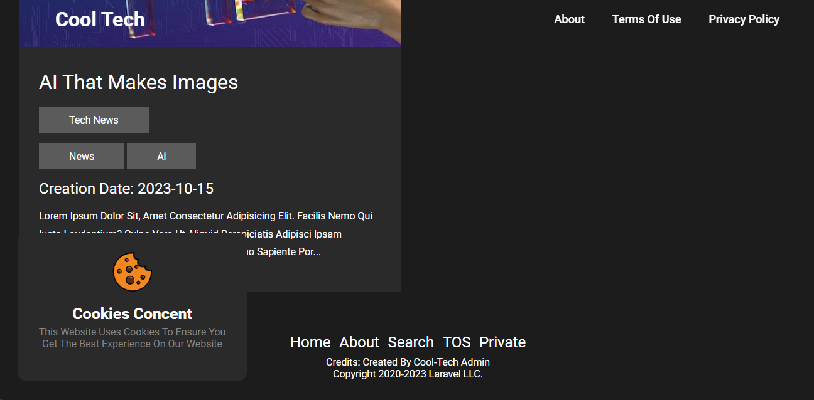
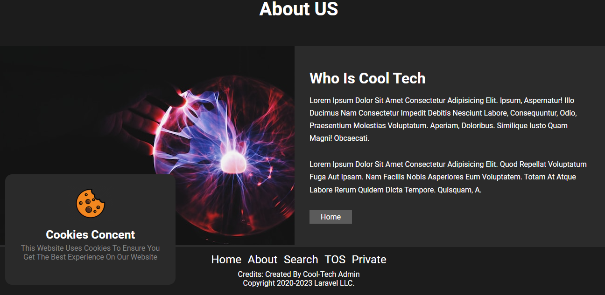
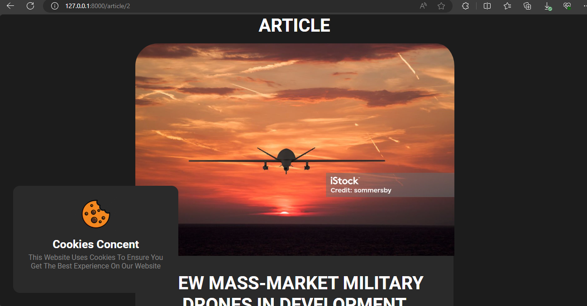
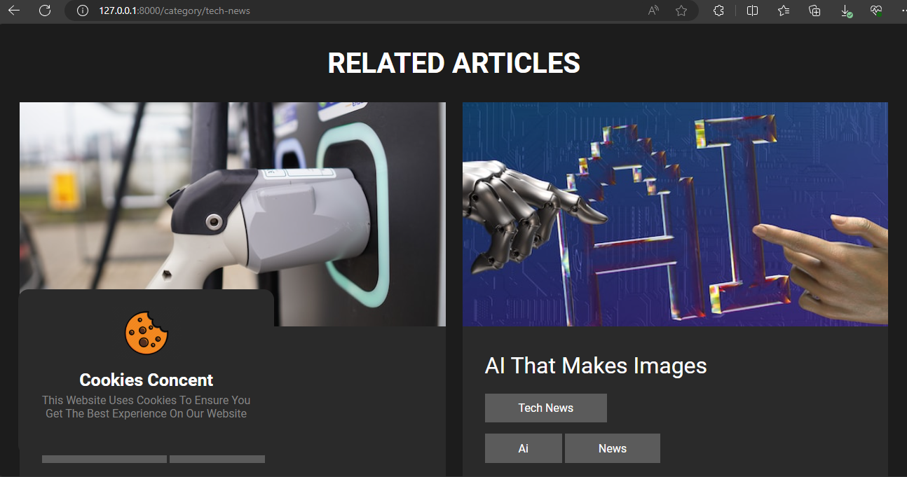
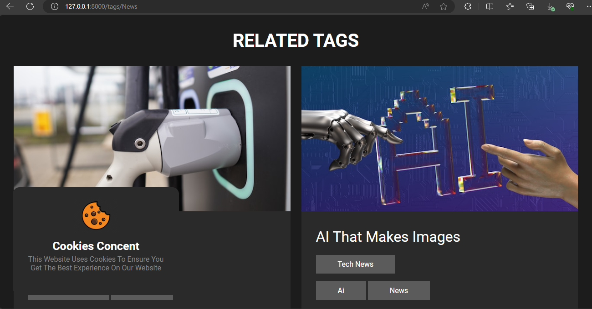
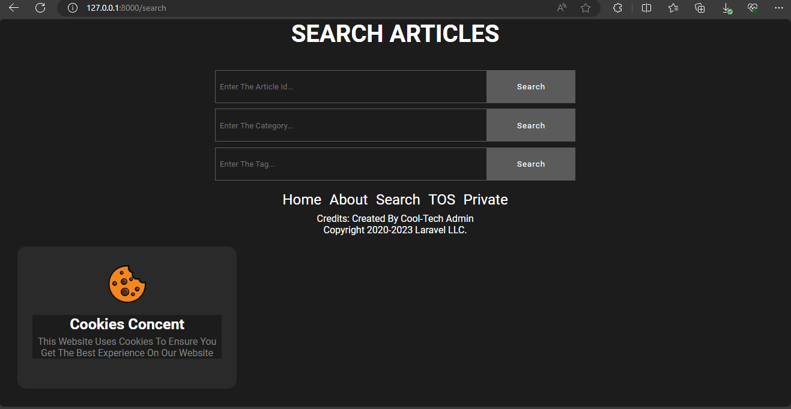

# Cool-Tech Cool Blog

For this project, I was tasked with creating a new dynamic website for a company called Cool Tech. The requirements were that the new website follow a simple blogging theme.

## Motivation
After learning PHP and MySql I accepted this task as I was confident and motivated to complete it. The challenge with this task was getting everything to work together so I used PHP as the language of the blog and MySql as the database and to join everything together I used Laravel to complete this project. I am proud to say this project is ready for real company use.

## Installation

- Download and install Composer if you don't already have it: https://getcomposer.org/doc/00-intro.md.
- Install Laravel with the following command from a terminal: composer global requires Laravel/installer.
- Download Microsoft SQL Server if you don't already have it: https://www.microsoft.com/en-us/sql-server/sql-server-downloads
- Download mysql shell and console on your computer

- Clone this Github repository into a directory of your choice.
- Run composer install in the project repository console
- Run php artisan serve in the console This will start the server and you can access your Laravel application at http://localhost:8000/ in your web browser.

If the project does not run then you should run the following in the console of a new repository:
- composer create-project laravel/laravel example-app
- replace the public, resources, routes files, and the .env file with the ones in the cloned repository.
- Run php artisan serve in the console This will start the server and you can access your Laravel application at http://localhost:8000/ in your web browser.
- I have added a MYSQL backup file for the project and to use it you should do the following in your console:
   + mysql -u root -p[root_password] [database_name] < dumpfilename.sql
   + Password and database name can be found in the .env file.
    
## Features

- Designed an appropriate database for the project using normalization.
- Database stores articles, their categories, and their tags.
  ##### ERD diagram for database
  
- The home page features the latest 5 articles each article title is a link to its appropriate article page.
- article view page which displays the selected article’s title, content, creation date, category, and tags.
-  category view page which lists all articles of a selected category.
- tag view page which behaves the same as the category view page, lists all articles of a selected tag.
- legal page which contains generic website Terms of Use and Privacy Policy content.
- Search page which has 3 search bars — one for article ID, category, and tag.
- a cookie notice that is displayed on every page of the blog.
- a footer that is displayed on all web pages. It has links to the search page and legal page.

## Screenshots
#### Home Page

#### About page

#### Article page

#### Catagory page

#### Tag page

#### search page

